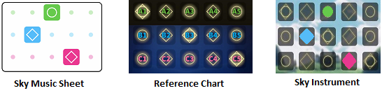

<h1>How to Read Sky Music Sheets</h1>

The visual music sheets on this website are a bit like <a href="https://sky-pod.github.io/discord.html">tablature</a>, which is a form of musical notation indicating instrument fingering rather than musical pitches.

So in the below example, you simply press where the Sky music chart asks you to, which on the ABC1-5 reference chart is A3, B2 and C4

<h3>What do the colours mean</h3>

They're just a way to differentiate between rows (A, B and C) to make the sheets a bit easier to read.

<strong>However!</strong>

If you find a section like the image below it generally means the notes are played in a fast pace, from light to dark colour.

Lastly, if you come across a blank space with a dot in the middle.

This signifies a pause in the song.

Please note that all the sheets on this website are fan made and are the creators own interpretation. If you already know the song and it's rythm in your head it will help reading the music sheets here.

If you notice any errors on a sheet or require any further assitance come and join our <a href="./discord.html">Discord</a>.

 <h2>Demo</h2>
  
 We can recommend <a href="http://skysheetmusic.com">skysheetmusic.com</a> as piano simulator to practise songs.

  <iframe src="https://player.vimeo.com/video/358248560" width="640" height="400" frameborder="0" allow="autoplay; fullscreen" allowfullscreen></iframe>
