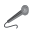

A collection of fan made visual music sheets/tablature for songs to learn in <a href="https://thatskygame.com/">Sky: Children of the light!</a>

If you would like to <a href="./make-your-own-sheet.html">create your own music sheet</a> please check the links in side bar for a tutorial, amongst other useful links.

Click a section to see a drop down list.

 
 Music Sheets

<ul>  
<li><a href="./songs/Astronomia-Coffin-Dance.html"> Astronomia (Coffin Dance)</a></li>
<li><a href="./songs/Cant-Help-Falling-in-Love-Intro.html"> Can't Help Falling in Love (Intro) </a></li>
<li><a href="./songs/graduation_photo.html"> Graduation Photo</a></li>
<li><a href="./songs/Hallelujah.html"> Hallelujah</a></li>
<li><a href="./songs/Illusionary-Daytime.html"> Illusionary Daytime</a></li>
<li><a href="./songs/illusionary_daytime_flute.html"> Illusionary Daytime Flute</a></li>
<li><a href="./songs/Kiss-the-Rain.html"> Kiss the Rain</a></li>
<li><a href="./songs/Love_Like_You.html"> Love Like You</a></li>
<li><a href="./songs/Piano-Man.html"> Piano Man</a></li>
<li><a href="./songs/River-Flows-in-You.html"> River Flows in You</a></li>
<li><a href="./songs/Superstition.html"> Superstition</a></li>
<li><a href="./songs/You-are-my-Sunshine.html"> You are my Sunshine</a></li>
</ul>

 

 
 Videogames

<ul>   
<li><a href="./songs/Dearly Beloved.html"> Dearly Beloved - Kingdom Hearts</a></li>
<li><a href="./songs/Emils-Sacrifice-NIER.html"> Emil's Sacrifice - NIER</a></li>
<li><a href="./songs/Korobeiniki-Tetris-Theme.html"> Korobeiniki Tetris Theme.html</a></li>
<li><a href="./songs/Pokemon-Center-Theme.html"> Pokemon Center Theme</a></li>
<li><a href="./songs/Song_Of_Storms.html"> Song of Storms - Legend of Zelda</a></li>
<li><a href="./songs/Super Mario (simple version).html"> Super Mario NES Theme (simple version)</a></li>
<li><a href="./songs/Super Mario.html"> Super Mario NES Theme (with chords)</a></li>
<li><a href="./songs/c418_sweden.html"> Sweden - Minecraft</a></li>
<li><a href="./songs/Threshold.html"> Threshold - Journey</a></li>
<li><a href="./songs/Zelda Lullaby.html"> Zelda's Lullaby - Ocarina of Time</a></li> 
</ul> 

 

 
 Anime

  
<ul> 
<li><a href="./songs/Always_with_Me_-_Spirited_Away_-_Ghibli.html"> Always With Me - Spirited Away</a></li>
<li><a href="./songs/Dango_daikazoku.html"> Dango Daikazoku - Kyoto Animation</a></li>
<li><a href="./songs/Fly-Me-to-the-Moon.html"> Fly Me to the Moon - Neon Genesis Evangelion</a></li>
<li><a href="./songs/Hokage-Funeral.html"> Hokage Funeral - Naruto</a></li>
<li><a href="./songs/Mitsuhas_Theme_Kimi_No_Na_wa.html"> Mitsuha's Theme - Kimi No Na wa - Your Name</a></li>
<li><a href="./songs/To-Loves-End-Futari-No-Kimochi.html"> To Love's End (Futari No Kimochi) - Inuyasha</a></li>
<li><a href="./songs/sky光遇——穿越时空的思念.html"> 穿越时空的思念</a></li>
</ul> 

 

  
 TV Shows & Movies

<ul> 
<li><a href="./songs/A-Whole-New-World-Aladdin.html"> A Whole New World - Aladdin</a></li>
<li><a href="./songs/Binary_Sunset_-_Star_Wars.html"> Binary Sunset - Star Wars</a></li>
<li><a href="./songs/Davy_Jones_Theme.html"> Davy Jones Theme - Pirates of the Caribbean</a></li>
<li><a href="./songs/Do-Re-Mi-Sound-of-Music.html"> Do-Re-Mi - The Sound of Music</a></li>
<li><a href="./songs/Godfather_Theme_Speak_Softly_Love.html"> Speak Softly, Love - Godfather Theme</a></li>
<li><a href="./songs/Harry_Potter_-_Hedwigs_Theme.html"> Hedwig's Theme - Harry Potter</a></li>
<li><a href="./songs/Little_Boxes.html"> Little Boxes - Weeds</a></li>
<li><a href="./songs/Married-Life-UP.html"> Married Life - UP</a></li>
<li><a href="./songs/My-Heart-Will-Go-On-Titanic-Theme.html"> My Heart Will Go On - Titanic Theme</a></li>
<li><a href="./songs/Rugrats_Theme.html"> Rugrats Theme</a></li>
<li><a href="./songs/Shiny.html"> Shiny - Moana</a></li>
<li><a href="./songs/Somewhere_Over_the_Rainbow.html">Somewhere Over the Rainbow - Wizard of Oz</a></li>
<li><a href="./songs/The-Raiders-March-Indiana-Jones-Theme.html"> The Raiders March - Indiana Jones Theme</a></li>
</ul> 

 

  
 Pop Music

<ul>  
<li><a href="./songs/Eleanor Rigby.html"> Eleanor Rigby (The Beatles)</a></li>
<li><a href="./songs/Hey Jude.html"> Hey Jude (The Beatles)</a></li>
<li><a href="./songs/Island in the Sun.html"> Island in the Sun (Weezer)</a></li>
<li><a href="./songs/Kaze wo atsumete.html"> Kaze wo atsumete (Happy End, 1971)</a></li>
<li><a href="./songs/Last_Christmas.html"> Last Christmas (first verse)</a></li>
<li><a href="./songs/Take on me.html"> Take on me (A-Ah)</a></li>
<li><a href="./songs/With a little help from my friends.html"> With a little help from my friends (The Beatles)</a></li>
<li><a href="./songs/Yellow Submarine.html"> Yellow Submarine (The Beatles)</a></li>
<li><a href="./songs/Yesterday.html"> Yesterday (The Beatles)</a></li>
<li><a href="./songs/Young Dumb and Broke.html"> Young Dumb & Broke (Khalid)</a></li>
</ul> 

 

 
 Classical

<ul>
<li><a href="./songs/Canon-in-C.html"> Canon in C</a></li>   
<li><a href="./songs/Carol-of-the-Bells.html"> Carol of the Bells</a></li>
<li><a href="./songs/Clair_de_Lune_-_Debussy.html"> Clair de Lune</a></li>
<li><a href="./songs/Fur Elise.html"> Für Elise</a></li>
<li><a href="./songs/Jesu-Joy-of-Mans-Desiring.html"> Jesu, Joy of Man's Desiring</a></li>
<li><a href="./songs/Brahms Lullaby.html"> Lullaby</a></li>
<li><a href="./songs/Ode to Joy.html"> Ode to Joy</a></li>
</ul> 

 

  
 Traditional

<ul>   
<li><a href="./songs/Amazing Grace.html"> Amazing Grace (John Newton)</a></li>
<li><a href="./songs/American folk songs.html"> American folk songs</a></li>
<li><a href="./songs/Flohwalzer.html"> Flohwalzer</a></li>
<li><a href="./songs/Scarborough-Fair.html"> Scarborough Fair</a></li>
</ul> 

