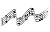

A collection of fan made visual music sheets/tablature for songs to learn in <a href="https://thatskygame.com/">Sky: Children of the Light!</a>

If you would like to <a href="./make-your-own-sheet.html">create your own music sheet</a> please check the links in side bar for a tutorial, amongst other useful links.

Click a section to see a drop down list.

 
 Anime 

  
<ul> 
 <li><a href="./songs/Big_Fish_and_Begonia.html"> Big Fish and Begonia </a></li>
 <li><a href="./songs/A_Cruel_Angels_Thesis.html"> Evangelion - A Cruel Angel's Thesis </a></li>
 <li><a href="./songs/Lyras Song.html"> Fairy Tail - Lyra's Song </a></li>
<li><a href="./songs/Merry_Go_Round_of_Life.html"> Howl's Moving Castle - Merry Go Round of Life </a></li>
<li><a href="./songs/To-Loves-End-Futari-No-Kimochi.html"> Inuyasha – To Love's End (Futari No Kimochi) </a></li>
<li><a href="./songs/sky光遇——穿越时空的思念.html"> Inuyasha - 穿越时空的思念</a></li>
<li><a href="./songs/Kikis_Delivery_Service_-_A_Town.html"> Kiki's Delivery Service - A Town With An Ocean View </a></li>
<li><a href="./songs/Mitsuhas_Theme_Kimi_No_Na_wa.html"> Kimi No Na wa - Your Name - Mitsuha's Theme </a></li>
<li><a href="./songs/Dango_daikazoku.html"> Kyoto Animation - Dango Daikazoku </a></li>
 <li><a href="./songs/MDZS_Wangxian_audio_drama_ver.html"> MDZS Wangxian (audio drama ver.) </a></li>
 <li><a href="./songs/Mononoke_Hime_-_Joe_Hisaishi.html"> Mononoke Hime </a></li>
<li><a href="./songs/Hokage-Funeral.html"> Naruto – Hokage Funeral </a></li>
<li><a href="./songs/Fly-Me-to-the-Moon.html">  Neon Genesis Evangelion – Fly Me to the Moon </a></li>
<li><a href="./songs/Always_with_Me-Spirited_Away.html"> Spirited Away - Always With Me </a></li>
<li><a href="./songs/Teru_no_UtaTherrus_Song.html"> Teru no UtaTherru's Song </a></li>
 <li><a href="./songs/Tokyo_Ghoul_-_Unravel.html"> Tokyo Ghoul - Unravel </a></li>
</ul> 

 
 Classical

<ul>
<li><a href="./songs/Jesu-Joy-of-Mans-Desiring.html"> Bach - Jesu, Joy of Man's Desiring</a></li>
<li><a href="./songs/Fur Elise.html"> Beethoven - Für Elise</a></li>
<li><a href="./songs/Ode to Joy.html"> Beethoven - Ode to Joy</a></li>
<li><a href="./songs/Brahms Lullaby.html"> Brahms - Lullaby</a></li>
<li><a href="./songs/Sonatine-in-C.html"> Clementi - Sonatine in C</a></li>
<li><a href="./songs/Clair_de_Lune_-_Debussy.html"> Debussy - Clair de Lune</a></li>
<li><a href="./songs/Salut-dAmour-Op-12.html"> Edgar - Salut d'Amour Op.12 (Love's Greeting)</a></li>
<li><a href="./songs/Carol-of-the-Bells.html"> Leontovych - Carol of the Bells</a></li>
<li><a href="./songs/Canon-in-C.html"> Pachelbel - Canon in C</a></li>
<li><a href="./songs/Marriage_d_Amour.html"> Richard Clayderman - Marriage d'amour </a></li>
<li><a href="./songs/Gran-Vals.html"> Tárrega - Gran Vals (Nokia Ringtone)</a></li> 
</ul> 

  
 Movies, TV Shows & Dramas 

<ul> 

<li><a href="./songs/无羁_wuji_0.html"> 陈情令（chenqingling ）main theme 无羁(wuji) </a></li>
<li><a href="./songs/A-Whole-New-World-Aladdin.html"> Aladdin – A Whole New World </a></li>
<li><a href="./songs/Anastasia_-_Once_Upon_A_December.html"> Anastasia - Once Upon A December </a></li>
<li><a href="./songs/Avatar_The_Last_Airbender_-_Avatars_Love.html"> Avatar: The last Airbender - Avatar's Love </a> </li>
<li><a href="./songs/Leaves-from-the-Vine.html"> Avatar: The last Airbender - Leaves from the Vine (Little Soldier Boy) </a> </li>
<li><a href="./songs/Beauty_And_The_Beast.html"> Beauty and the Beast </a></li>
<li><a href="./songs/Heart_and_Soul.html"> Big - Heart and Soul (Single/Duet) </a></li>
<li><a href="./songs/Tubular-Bells-Exorcist-Theme.html"> Exorcist – Tubular Bells</a></li>
<li><a href="./songs/All_Is_Found.html"> Frozen 2 - All Is Found</a></li>
<li><a href="./songs/Godfather_Theme_Speak_Softly_Love.html"> Godfather – Speak Softly, Love </a></li>
<li><a href="./songs/Harry_Potter_-_Hedwigs_Theme.html"> Harry Potter – Hedwig's Theme</a></li>
<li><a href="./songs/Test-Drive.html"> How to Train your Dragon – Test Drive</a></li>
<li><a href="./songs/The-Raiders-March-Indiana-Jones-Theme.html"> Indiana Jones – The Raiders March</a></li>
<li><a href="./songs/Jurassic-Park-Theme.html"> Jurassic Park Theme</a></li>
<li><a href="./songs/Kung_Fu_Panda_-_Oogway_Ascends.html"> Kung Fu Panda - Oogway Ascends</a></li>
<li><a href="./songs/Breaking_of_the_Fellowship.html"> Lord of the Rings - Breaking of the Fellowship </a></li>
<li><a href="./songs/Shiny.html"> Moana – Shiny </a></li>
<li><a href="./songs/How-Far-Ill-Go.html"> Moana – How Far I'll Go </a></li>
<li><a href="./songs/Falling-Slowly.html"> Once - Falling Slowly </a></li>
<li><a href="./songs/Davy_Jones_Theme.html"> Pirates of the Caribbean – Davy Jones Theme</a></li>
<li><a href="./songs/Pocahontas_-_Colors_of_the_Wind.html"> Pocahontas - Colors of the Wind</a></li>
<li><a href="./songs/Rugrats_Theme.html"> Rugrats Theme</a></li>
<li><a href="./songs/Song_of_the_Sea.html"> Song of the Sea – Lisa Hannigan – Song of the Sea</a></li>
<li><a href="./songs/Do-Re-Mi-Sound-of-Music.html"> Sound of Music – Do-Re-Mi </a></li>
<li><a href="./songs/Binary_Sunset_-_Star_Wars.html">  Star Wars – Binary Sunset</a></li>
<li><a href="./songs/The_Office_Theme.html"> The Office - The Office Theme </a></li>
<li><a href="./songs/My-Heart-Will-Go-On-Titanic-Theme.html"> Titanic Theme – My Heart Will Go On</a></li>
<li><a href="./songs/Married-Life-UP.html"> UP – Married Life </a></li>
<li><a href="./songs/Little_Boxes.html"> Weeds – Little Boxes</a></li>
<li><a href="./songs/Somewhere_Over_the_Rainbow.html"> Wizard of Oz – Somewhere Over the Rainbow</a></li>

</ul> 

 
 Songs

<ul>  
<li><a href="./songs/Take on me.html"> A-Ah - Take on me</a></li>
<li><a href="./songs/Lonely.html"> Akon – Lonely </a></li>
<li><a href="./songs/I_Built_A_Friend.html"> Alec Benjamin - I Built A Friend </a></li>
<li><a href="./songs/thank_u_next.html"> Ariana Grande - thank u, next</a></li>
<li><a href="./songs/Astronomia-Coffin-Dance.html"> Astronomia (Coffin Dance)</a></li>
<li><a href="./songs/Redemption_Song.html"> Bob Marley – Redemption Song</a></li>
<li><a href="./songs/Eleanor Rigby.html"> Beatles, The – Eleanor Rigby</a></li>
<li><a href="./songs/Hey Jude.html"> Beatles, The – Hey Jude </a></li>
<li><a href="./songs/With a little help from my friends.html"> Beatles, The – With a little help from my friends </a></li>
<li><a href="./songs/Yellow Submarine.html"> Beatles, The – Yellow Submarine </a></li>
<li><a href="./songs/Yesterday.html"> Beatles, The – Yesterday </a></li>
<li><a href="./songs/Stand-By-Me-Bass.html"> Ben E. King - Stand By Me (Bassline) </a></li>
<li><a href="./songs/Piano-Man.html"> Billy Joel – Piano Man</a></li>
<li><a href="./songs/Hold_On.html"> Chord Overstreet - Hold On </a></li>
<li><a href="./songs/Say_So_-_Doja_Cat.html"> Doja Cat – Say So</a></li>
<li><a href="./songs/Cant-Help-Falling-in-Love-Intro.html"> Elvis Presley – Can't Help Falling in Love (Intro) </a></li>
<li><a href="./songs/graduation_photo.html"> Graduation Photo</a></li>
<li><a href="./songs/Hallelujah.html"> Hallelujah</a></li>
<li><a href="./songs/Kaze wo atsumete.html">  Happy End – Kaze wo atsumete</a></li>
<li><a href="./songs/Popcorn.html"> Hot Butter – Popcorn </a></li>
<li><a href="./songs/If_You're_Happy_and_You_Know_it.html"> If You're Happy and You Know It </a></li>
<li><a href="./songs/Young Dumb and Broke.html"> Khalid – Young Dumb & Broke </a></li>
<li><a href="./songs/Alone0.html"> Marshmello - Alone </a> </li>
<li><a href="./songs/Daydreaming.html"> Radiohead - Daydreaming </a></li>
<li><a href="./songs/Love_Like_You.html"> Rebecca Sugar – Love Like You </a></li>
<li><a href="./songs/Lost_Boy.html"> Ruth B - Lost Boy </a></li>
<li><a href="./songs/Illusionary-Daytime.html"> Shirfine – Illusionary Daytime </a></li>
<li><a href="./songs/illusionary_daytime_flute.html"> Shirfine – Illusionary Daytime Flute</a></li>
<li><a href="./songs/Superstition.html"> Stevie Wonder –  Superstition</a></li>
<li><a href="./songs/Safe_and_Sound.html"> Taylor Swift –  Safe and Sound </a></li>
 <li><a href="./songs/Sad_Song.html"> We The Kings - Sad Song </a></li>
<li><a href="./songs/Island in the Sun.html"> Weezer – Island in the Sun </a></li>
<li><a href="./songs/Last_Christmas.html"> Wham! – Last Christmas </a></li>
<li><a href="./songs/Translucent.html"> Yanaginagi –  Translucent</a></li>
<li><a href="./songs/Kiss-the-Rain.html"> Yiruma – Kiss the Rain </a></li>
<li><a href="./songs/River-Flows-in-You.html"> Yiruma – River Flows in You</a></li>
<li><a href="./songs/You-are-my-Sunshine.html"> You are my Sunshine</a></li>

</ul>

  
 Traditional

<ul>   
<li><a href="./songs/Amazing Grace.html"> Amazing Grace (John Newton)</a></li>
<li><a href="./songs/American folk songs.html"> American folk songs</a></li>
<li><a href="./songs/Drunken-Sailor.html"> Drunken Sailor</a></li>
<li><a href="./songs/Flohwalzer.html"> Flohwalzer</a></li>
<li><a href="./songs/Happy_Birthday.html"> Happy Birthday </a></li>
<li><a href="./songs/Scarborough-Fair.html"> Scarborough Fair</a></li>
<li><a href="./songs/State_Anthem_of_the_USSR.html"> Soviet Union National Anthem</a></li>
<li><a href="./songs/Tha_Mi_Sgith.html"> Tha Mi Sgith</a></li>
 <li><a href="./songs/Wedding_March.html"> Wedding March </a></li>
</ul> 

 
 Videogames

<ul>   
<li><a href="./songs/Build-that-wall-Bastion.html"> Bastion - Build That Wall (Zia's Theme)</a></li>
<li><a href="./songs/Threshold.html"> Journey - Threshold </a></li>
<li><a href="./songs/Dearly Beloved.html"> Kingdom Hearts – Dearly Beloved </a></li>
<li><a href="./songs/Song_Of_Storms.html"> Legend of Zelda – Song of Storms</a></li>
<li><a href="./songs/Zelda Lullaby.html"> Legend of Zelda - Zelda's Lullaby</a></li> 
<li><a href="./songs/c418_sweden.html"> Minecraft – Sweden </a></li>
<li><a href="./songs/Emils-Sacrifice-NIER.html">  NieR – Emil's Sacrifice </a></li>
<li><a href="./songs/Shadowlord-NieR.html">  NieR – Shadowlord </a></li>
<li><a href="./songs/Pokemon-Center-Theme.html"> Pokemon Center Theme</a></li>
<li><a href="./songs/Promise_Reprise_-_Silent_Hill_2.html"> Silent Hill 2 - Promise (Reprise) </a></li>
<li><a href="./songs/Stardew_Valley_-_Wind_can_be_Still_Winter.html"> Stardew Valley - Wind can be still Winter </a></li>
<li><a href="./songs/Super Mario (simple version).html"> Super Mario NES Theme (simple version)</a></li>
<li><a href="./songs/Super Mario.html"> Super Mario NES Theme (with chords)</a></li>
<li><a href="./songs/Korobeiniki-Tetris-Theme.html"> Tetris Theme - Korobeiniki</a></li>
<li><a href="./songs/Future_Days.html"> The Last Of Us II - Future Days </a></li>
<li><a href="./songs/Hoshi_no_Arika_-_Trails_in_the_Sky_FC.html"> Trails in the Sky FC - Hoshi no Arika </a></li>
</ul> 

