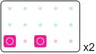
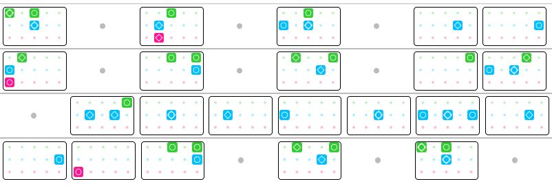

<h1>Make your own visual music sheet!</h1>

Here's a step by step guide how to create your own visual music sheet.

<b>(If you wish to avoid installing Python, use the beta online version <a href="https://jmmelko.pythonanywhere.com/" target="_blank">Here</a> and skip to step 3)</b>
<h2>Step 1 - Install Python</h2>

If you don't yet have Python 3 already installed on your computer you can download it by clicking <a href="https://www.python.org/downloads/" target="_blank">Here</a>

Once installed, open cmd (Command Prompt) on Windows, or Terminal on Mac, then copy and paste these commands:

<pre>
  <code>
python3 -m pip install --upgrade pip
python3 -m pip install --upgrade pillow
pip install mido==1.2.9
  </code>
</pre>
    
<h2>Step 2 - Run Python Music Sheet Maker</h2>

Download the Sky Music Sheet Maker by clicking <a href="https://github.com/sky-music/sky-python-music-sheet-maker" target="_blank">Here</a>. Click on the green "Clone or Download" button, then choose "Download ZIP".

For the sake of an example let's extract this to your Desktop.

Open cmd on Windows, or Terminal on Mac, and enter the following command:

<pre>
  <code>
cd Desktop/sky-python-music-sheet-maker-master/python
  </code>
</pre>
    
<i>(If you wish to store the folder elsewhere or change it's name, please change this command accordingly afterwards).</i>

While still in cmd on Windows, enter:

<pre>
  <code>
command_line_player.py
  </code>
</pre>

OR while still in terminal on Mac, enter:

<pre>
  <code>
python3 command_line_player.py
  </code>
</pre>

<h2>Step 3 - Write your music</h2>
We recommend typing out your notation in Notepad or similar before inputting into cmd/Terminal, as it's easier for you to fix any mistakes this way.

For the benefit of this tutorial we'll use the most recognised ABC1-5 method, however you may find other supported notations <a href="./assets/images/notations.png" target="_blank">Here</a>, replace the notation in this guide accordingly.

If you're unfamilliar with this chart or how it it reads please check out the <a href="./how-to-read.html">How to Read</a> page.

Seperate boxes by using a blank space, for example typing "B3 B4 B5" will produce:

Type letters with no space for a chord, for example typing "A1A3A5 B1B3B5" will produce:

Use . for blank notes, used to signify a pause in the song, for example typing "B4 . B5" will produce:

<i>If using Jianpu notation please use 0 instead</i>

Use - for coloured notes, used to signify pressing buttons in a fast pace one after the other, for example "A3-B1-B3-B5-C3" will produce:

<i>If using Jianpu notation please use ^ instead</i>

To indicate a repeat section, use * directly followed by a number, for example "C1C3 *2" will produce:

Tip 1: We usually find 8 boxes a row works best.

Tip 2: Do not use a blank line as this will end the song. If you need a blank line in the song use . for blank notes.

<h2>Step 4 - Input your music!</h2>
With your music typed out, now simply copy and paste all of your notes into cmd/terminal after you've followed Step 2.
To end the song, press 'Enter' for a new line, then press 'Enter' again on the blank line.

You'll now be asked to input a recommended key (leave blank if unsure), the song title, original artist and who it was transcribed by (your name).

Your song will be saved in html format to the /songs_out/ folder where you saved the sky-python-music-sheet-maker folder.

<h2>Finished Example</h2>

Let's look at the intro to '<a href="./songs/Cant-Help-Falling-in-Love-Intro.html">Can't help falling in love with you</a>' by Elvis Presley.

Following the guide above, in CMD or Terminal we input:
<pre>
  <code>
A1A3B3 . A3B2C2 . A3B1B3 . B4 B5
A2B1C1 . A3A5B5 . A2A5B4 . A5 A4B1B3
. A5B2B4 . B1B3B5 . B4 B5 C1
A3A5B5 . A2A5B4 . A1A3B3 . . .
  </code>
</pre>

And out comes:

<h2>We would love to have your song on this website!</h2>

Join our <a href="./discord.html">Discord</a> and send us the file so we can upload it here! We can also embed an accompanying video if you have one hosted somewhere.

All we ask is that you quality check your sheet before submitting, as others will be learning from it too.

If you need any support or would like to ask questions you can join our <a href="./discord.html">Discord</a> server by clicking <a href="./discord.html">Here</a>

[Link to site repository](https://github.com/sky-music/sky-music.github.io)

