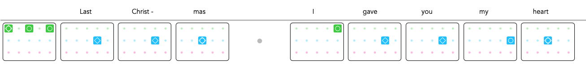

<h1>Make your own visual music sheet!</h1>

Here's a step by step guide how to create your own visual music sheet.

<b>If you wish to avoid installing Python, use the website version <a href="https://jmmelko.pythonanywhere.com/" target="_blank">here</a> or the <a href="https://discord.gg/thatskygame">Discord Bot version</a> by typing `!song` and skip to step 3.</b>

There's also <a href="https://sky.bloomexperiment.com/t/sky-music-icon-templates/746" target="_blank">these</a> blank sheet templates if you prefer this method.

<h2>Step 1 - Install Python</h2>

If you don't yet have Python 3 already installed on your computer you can download it by clicking <a href="https://www.python.org/downloads/" target="_blank">here</a>.
Unless you have a good reason for doing otherwise, you should download the "Windows x86-64 executable installer". Don't forget to check the box "Add Python to environment variables".

Once installed, open cmd (Command Prompt) on Windows, or Terminal on Mac. Then copy and paste these commands into the console:

<pre>
  <code>
python3 -m pip install --upgrade pip
python3 -m pip install --upgrade pillow
pip install mido==1.2.9
pip install pyyaml
  </code>
</pre>

Then, type the following command:

<pre>
  <code>
python3 --version
  </code>
</pre>

If the displayed Python version is < 3.8, please type this additional command:

<pre>
  <code>
pip install importlib_resources
  </code>
</pre>

On Windows, you can also install a more complete version of Python known as <a href="https://sourceforge.net/projects/winpython/">WinPython</a>, and under Windows or MacOS <a href="https://www.anaconda.com/products/individual">Anaconda</a>. In this case the <i>pip</i> commands must be typed in the console of the Spyder code editor. Only <i>mido</i> has to be installed (for generating Midi files), and <i>importlib_resources</i> only if the Python version is < 3.8.

<h2>Step 2 - Run Python Music Sheet Maker</h2>

Download the Sky Music Sheet Maker by clicking <a href="https://github.com/sky-music/sky-python-music-sheet-maker" target="_blank">Here</a>. Click on the green "Clone or Download" button, then choose "Download ZIP".

For the sake of an example let's extract this to your Desktop.

Open cmd on Windows, or Terminal on Mac, and enter the following command:

<pre>
  <code>
cd Desktop/sky-python-music-sheet-maker/src/skymusic
  </code>
</pre>
    
<i>(If you wish to store the folder elsewhere or change it's name, please change this command accordingly afterwards).</i>

While still in cmd on Windows, enter:

<pre>
  <code>
command_line_player.py
  </code>
</pre>

OR while still in terminal on Mac, enter:

<pre>
  <code>
python3 command_line_player.py
  </code>
</pre>

<h2>Step 3 - Write your music</h2>
We recommend typing out your notation in Notepad or similar before inputting into cmd/Terminal, as it's easier for you to fix any mistakes this way.

For the benefit of this tutorial we'll use the most recognised ABC1-5 method, however you may find other supported notations <a href="./assets/images/notations.png" target="_blank">Here</a>, replace the notation in this guide accordingly.

If you're unfamilliar with this chart or how it it reads please check out the <a href="./how-to-read.html">How to Read</a> page.

Separate boxes by using a blank space, for example typing "B3 B4 B5" will produce:

Type letters with no space for a chord, for example typing "A1A3A5 B1B3B5" will produce:

Use . for blank notes, used to signify a pause in the song, for example typing "B4 . B5" will produce:

<i>If using Jianpu notation please use 0 instead</i>

Use - for coloured notes, used to signify pressing buttons in a fast pace one after the other from light to dark colour, for example "A3-B1-B3-B5-C3" will produce:

<i>If using Jianpu notation please use ^ instead</i>

To indicate a repeat section, use * directly followed by a number, for example "C1C3 *2" will produce:

Add a line break (press enter in Python or in your text editor) to separate song lines with an horizontal divider.

Use '#' to start a lyrics line. Type '#' again to split the lyrics and align words with the chords grid: 

<pre>
 # #Last #Christ - #mas # #I #gave #you    #my #heart
A1A3A5 B4 B4 B3 . C5 B4 B4 B5 B3
</pre>

You can also use '#' to add a header (section title), and format it using HTML tags. For instance:
<code>#&lt;h1 style="color:red;"&gt;Section 1&lt;/h1&gt;</code>
 will produce a section title in big, bold, red letters. This will work with HTML output files but be ignored in other formats.

Use this with great caution as any error in these tags can break the whole HTML file. 

Tip 1: We usually find 8 boxes a row works best for a 16:9 aspect ratio (widescreen). Use line breaks to divide your song in rows.

Tip 2: In the Python command-line program do not press enter after a blank line as this will end the song. If you need a full blank line in the song use '.' for blank notes or enter a lyrics line with no text.

<h2>Step 4 - Input your music!</h2>
With your music typed out, now simply copy and paste all of your notes into cmd/terminal after you've followed Step 2.
To end the song, press 'Enter' for a new line, then press 'Enter' again on the blank line.

You'll now be asked to input a recommended key (leave blank if unsure), the song title, original artist and who it was transcribed by (your name).

Your song will be saved in html format to the /songs_out/ folder where you saved the sky-python-music-sheet-maker folder.

<h2>Finished Example</h2>

Let's look at the intro to '<a href="./songs/Cant-Help-Falling-in-Love-Intro.html">Can't help falling in love with you</a>' by Elvis Presley.

Following the guide above, in CMD or Terminal we input:
<pre>
  <code>
A1A3B3 . A3B2C2 . A3B1B3 . B4 B5
A2B1C1 . A3A5B5 . A2A5B4 . A5 A4B1B3
. A5B2B4 . B1B3B5 . B4 B5 C1
A3A5B5 . A2A5B4 . A1A3B3 . . .
  </code>
</pre>

And out comes:

<h2>We would love to have your song on this website!</h2>

Join our <a href="./discord.html">Discord</a> and send us the file so we can upload it here! We can also embed an accompanying video if you have one hosted somewhere.

All we ask is that you quality check your sheet before submitting, as others will be learning from it too.

<h2>Going further: understanding input and output file formats</h2>

If you intend to use the visual sheets outside our website, you can export them to different file formats. PNG is recommended for quick sharing of songs to friends, but cannot be edited or stretched out. TXT formats are useful for sharing song notes.
Finally, the Sky-JSON recordings (text format) can be fed to the <a href="http://sky-music.herokuapp.com">SkyMusic website</a>, the Android <a href="https://play.google.com/store/apps/details?id=com.herokuapp.sky_music.twa">Sky Music app</a> and to the Android Sky Studio app.

For input, besides text, the Visual Sheet Maker also accepts HTML Visual Sheets (only for sheets generated after July, 2020 1st). This way, you can generate a new version of a sheet if you have lost the song notes.
The program also accepts Sky-JSON recordings generated by SkyMusic and SkyStudio.

If you need any support or would like to ask questions you can join our <a href="./discord.html">Discord</a> server by clicking <a href="./discord.html">Here</a>.

<a bref="https://github.com/sky-music/sky-music.github.io"> Link to site repository</a>

